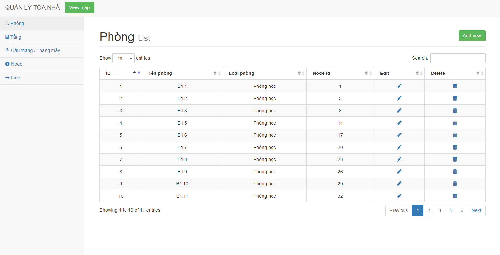
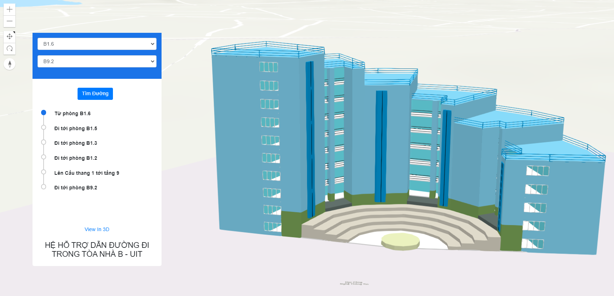
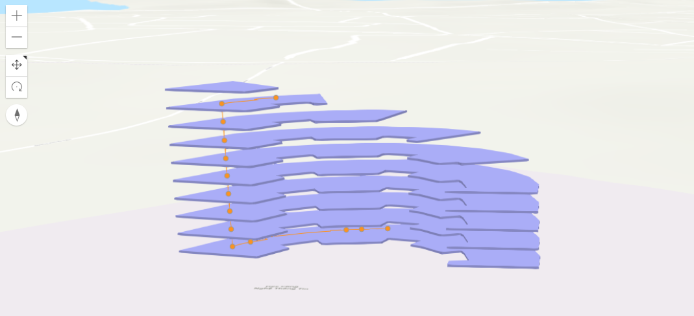

<p align="center"><a href="https://laravel.com" target="_blank"></a></p>

## Giới thiệu

Đồ án môn học: Hệ thống thông tin địa lý 3 chiều

Đề tài: Hệ thống hỗ trợ dẫn đường đi trong tòa nhà B

Giảng viên hướng dẫn: Thầy Phan Thanh Vũ

Nhóm thực hiện: Nhóm 4
- Trương Minh Trí 17521157
- Nguyễn Sỹ Cảnh Hưng 17520545
- Nguyễn Hải Huy 17520076

## Các bước cài đặt

### Cài đặt môi trường
Đề tài xây dựng trên:

- PHP (v3.3.27)
- Laravel (v7.29)
- MySQL (v8.0.25)

### Chạy ứng dụng

Tại thư mục gốc của project, config các thông tin database và các biến môi trường khác cho phù hợp.

Cài đặt các thư viện cần thiết

```bash
composer install
```

Migrate database với lệnh

```bash
php artisan migrate
# Tạo các table trong database
```

Chạy server
```bash
php artisan serve
# Server mặc định chạy tại port 8000
```

### Cách Import database mẫu cho mục đích test

Database mẫu được backup lưu tại file "Bbuilding.sql"

```bash
root directory
├── database_demo_bak
│   ├── Bbuilding.sql
│   
```

Chạy file này để import database

## Giao diện trang Web

### Trang Admin



### Trang tìm đường



### Trang biểu diễn đường đi trên mô hình 3D

